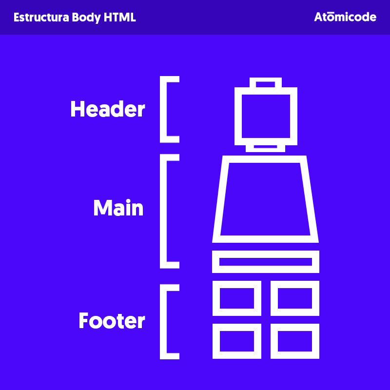

# Bienvenido al Nivel 0 
Ahora estas en el nivel inicial, no importa si no sabes html, conforme vayamos progresando iremos aprendiendo lo necesario para poder avanzar al siguiente nivel. 

## Fundamentos de HTML
HTML es la estructura de una página  web (textos, imagenes, listas, etc) y está formado por etiquetas que sirven para poder darle forma a nuestro documento.

Para ejemplificar la estructura de un documento HTML tomemos como base la caja de un muñeco de lego, en la parte de arriba se describen cosas como su nombre y datos relevantes del producto (*Head*) y más abajo el muñeco como tal (*Body*).


Dentro del documento HTML el *Head* vendría siendo la información más importante, sirve para poder ponerle un título a la pestaña, entre otras cosas que iremos viendo más adelante, cabe destacar que la mayor parte de esa información no se muestra al usuario, sino que las lee el navegador para interpretar el documento.
El *Body* por su parte es todo aquello que podemos ver dentro de la página.
### Estructura de un documento HTML
```HTML
<!DOCTYPE html>
<html lang="en"> 
<head>
    Aquí van los datos relevantes del documento
    <meta charset="UTF-8">
    <title>Nombre de la Pestaña</title>
</head>
<body>
    Aquí irá todo el contenido de nuestra página web
</body>
</html>
```

## Estructura del Body
Dentro del Body es donde irá todo lo vamos a mostrar por pantalla en la página, para una buena práctica hay que tener en cuenta de que esta parte debe de estar dividida en 3 partes, el *Header*, el *Body* y el *Footer*, sirven para dar un orden a la información del body, es algo que hay que tenerlo en cuenta.
Para dejarlo más claro, imaginemos que armaramos una muñeco de lego, primero ponemos la cabeza (*Header*), luego ponemos el cuerpo (*Body*) y al final los pies (*Footer*), en un documento HTML 


```HTML
<body>
    <header>
        Aquí van los menus por lo regular, pero se pueden poner otras cosas dentro
    </header>
    <body>
        aqui va todo lo relevante (post, parrafos, imágenes, etc)
    </body>
    <footer>
        aqui van los menus que se encuentran al final de las páginas web, además de eso
        pueden ir otras cosas, pero en este momento no son importantes
    </footer>
</body>
```
## Componentes de HTML
## Ejercicio Básico

## Ejemplo

```javascript

```


## Screenshots


